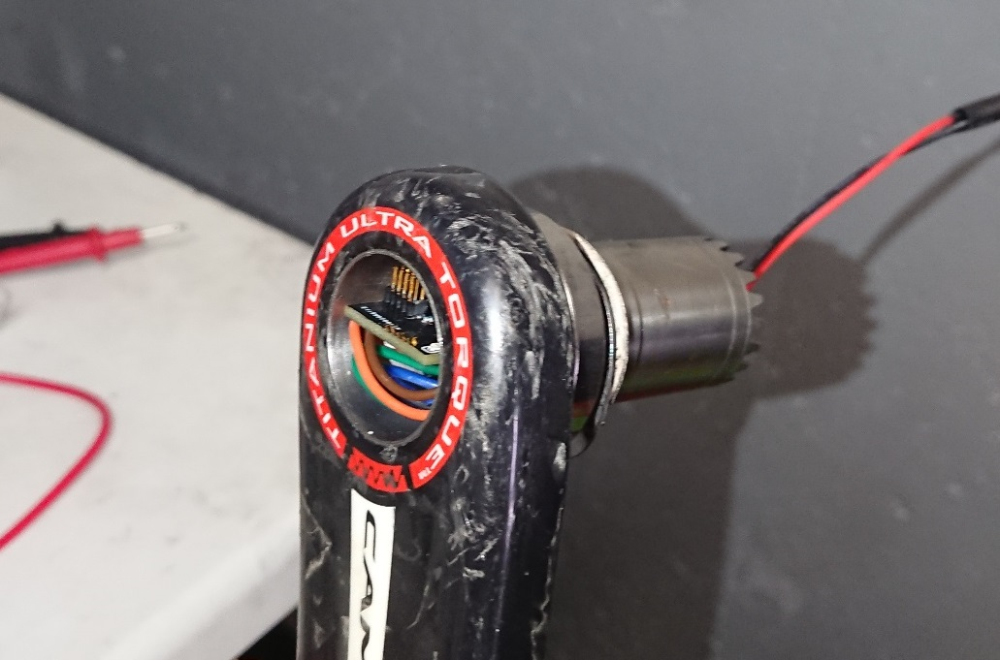

# ANT+ Power Meter

This is the source code for a ANT+ power meter using NRF5 SDK (SoftDevice 212).
The board is custom-made and the schematics can be downloaded here (CC licence):

https://oshwlab.com/tim.wintz/powermeter

On top of the board, a full-bridge strain gauge is needed, as well as a battery. To program the chip, a JTAG programmer with a 1.27mm 10pin connector (for example JTAG Edu Mini) is required.

Below is a picture of the board integrated in a Super Record crank semi-axle:



It could also be used as a left-crank based power meter.

# Features

Implemented and TODO features:

- [x] ANT+ Bike Power Profile
- [x] Offset calibration
- [x] Auto zero
- [x] Battery status
- [x] Auto sleep and wakeup using accelerometer interrupts
- [ ] Temperature compensation
- [ ] ANT Crank length setting 
- [ ] OTA Scale calibration using ANT
- [ ] OTA Firmware update 
- [ ] BLE Bicycle Power GATT profile (needs a different softdevice)

# Building and flashing

To build and flash the firmware, you will need

- [NRF5 SDK 17](https://www.nordicsemi.com/Software-and-tools/Software/nRF5-SDK)
- [ANT Softdevice 212](https://www.thisisant.com)
- [GNU Arm Embedded Toolchain](https://developer.arm.com/tools-and-software/open-source-software/developer-tools/gnu-toolchain/gnu-rm/downloads)
- [Segger JLink](https://www.segger.com/downloads/jlink/)

The folder is preconfigured to work with VS-Code. To flash the softdevice use:

```
make flash_sd
```

To flash the firmware:

```
make flash_sd DEBUG=1
```

You can use Jlink RTT to monitor the output (needed for scale calibration).

# Calibrating weight

TODO: for now you must use the debugger to calibrate the scaling of the gage. This is a bit impractical...

# Precision

TODO